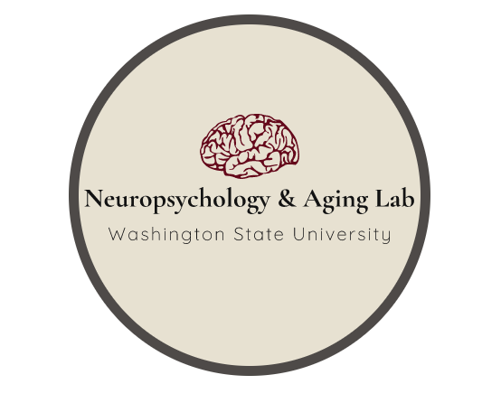

<!-- Improved compatibility of back to top link: See: https://github.com/othneildrew/Best-README-Template/pull/73 -->
<a name="readme-top"></a>
<!--
*** Thanks for checking out the Best-README-Template. If you have a suggestion
*** that would make this better, please fork the repo and create a pull request
*** or simply open an issue with the tag "enhancement".
*** Don't forget to give the project a star!
*** Thanks again! Now go create something AMAZING! :D
-->


<!-- PROJECT SHIELDS -->
<!--
*** I'm using markdown "reference style" links for readability.
*** Reference links are enclosed in brackets [ ] instead of parentheses ( ).
*** See the bottom of this document for the declaration of the reference variables
*** for contributors-url, forks-url, etc. This is an optional, concise syntax you may use.
*** https://www.markdownguide.org/basic-syntax/#reference-style-links
-->
[![Contributors][contributors-shield]][contributors-url]
[![Forks][forks-shield]][forks-url]
[![Stargazers][stars-shield]][stars-url]
[![Issues][issues-shield]][issues-url]
[![MIT License][license-shield]][license-url]
[![LinkedIn][linkedin-shield]][linkedin-url]


<!-- PROJECT LOGO -->
<br />
<div align="center">
  <a href="https://github.com/Reaganak40/gerontechnology">
    
  </a>

<h3 align="center">Gerontechnology - GSUR</h3>

  <p align="center">
    This repo contains software for ETL pipelines and research tools for the Neuropsychology and Aging Laboratory. The EMMA study is a research program being conducted by Dr. Schmitter-Edgecombe at Washington State University. This project is funded by the Department of Defense and has been reviewed and approved by the Washington State University Institutional Review Board. In this repo,
    you will find software used in the EMMA data-wrangling procedures, research querying tools, and the dashboard UI which is a web-based application.
    <br />
    <a href="https://labs.wsu.edu/neuropsychology-aging/home/emma-information/"><strong>Learn More »</strong></a>
    <br />
    <br />
    <a href="https://github.com/Reaganak40/gerontechnology/blob/main/docs/OFFLINE%20-%20EMMA%20Gerontechnology%20Docs.pdf">View Docs</a>
    ·
    <a href="https://github.com/Reaganak40/gerontechnology/issues">Report Bug</a>
    ·
    <a href="https://github.com/Reaganak40/gerontechnology/issues">Request Feature</a>
  </p>
</div>


<!-- ABOUT THE PROJECT -->
## About The Project

The GSUR program is to explore the links between such diverse and yet complementary disciplines of computer science, electrical engineering, nursing, sociology, medicine and clinical psychology.
The neuropsychology and aging laboratory uses this code to compile and transform raw data from the EMMA project. It uses JSON to define complicated variables that researchers wish to
extract from the EMMA application. The data-wrangling software can automatically extract, transform, and load incoming data into mySQL databases. Researchers can further query the data through a specialized
querying application to interact with weekly calculation tables. The EMMA Dashboard is also available as a web-based UI to provide a snapshot of how participants are progressing through the study.

### Built With

* 
* 
* 
* 
* 
* 
* 
* 
* 

<p align="right">(<a href="#readme-top">back to top</a>)</p>


<!-- GETTING STARTED -->
## Getting Started

Depending on which tools you intend to use, you will need to install different perquisites. Utilize
npm and pip for these.

### Prerequisites

Install the latest npm packages and use the requirements file to install all python modules via pip.
* npm
  ```sh
  npm install npm@latest -g
  ```

* pip
  ```sh
  pip install -r requirements.txt
  ```

### Installation

Clone the repo
   ```sh
   git clone https://github.com/Reaganak40/gerontechnology.git
   ```
<p align="right">(<a href="#readme-top">back to top</a>)</p>

<!-- USAGE EXAMPLES -->
## Usage

Use this space to show useful examples of how a project can be used. Additional screenshots, code examples and demos work well in this space. You may also link to more resources.

_For more examples, please refer to the [Documentation](https://github.com/Reaganak40/gerontechnology/blob/main/docs/OFFLINE%20-%20EMMA%20Gerontechnology%20Docs.pdf)_

<p align="right">(<a href="#readme-top">back to top</a>)</p>


<!-- ROADMAP -->
## Roadmap

- [x] Date-Wrangling
- [x] Research Query
- [ ] EMMA Dashboard

See the [open issues](https://github.com/Reaganak40/gerontechnology/issues) for a full list of proposed features (and known issues).

<p align="right">(<a href="#readme-top">back to top</a>)</p>


<!-- CONTRIBUTING -->
## Contributing

Contributions are what make the open source community such an amazing place to learn, inspire, and create. Any contributions you make are **greatly appreciated**.

If you have a suggestion that would make this better, please fork the repo and create a pull request. You can also simply open an issue with the tag "enhancement".
Don't forget to give the project a star! Thanks again!

1. Fork the Project
2. Create your Feature Branch (`git checkout -b feature/AmazingFeature`)
3. Commit your Changes (`git commit -m 'Add some AmazingFeature'`)
4. Push to the Branch (`git push origin feature/AmazingFeature`)
5. Open a Pull Request

<p align="right">(<a href="#readme-top">back to top</a>)</p>


<!-- LICENSE -->
## License

Distributed under the Apache-2.0 license. See `LICENSE.txt` for more information.

<p align="right">(<a href="#readme-top">back to top</a>)</p>

<!-- CONTACT -->
## Contact

Reagan Kelley - reaganak@gmail.om

<p align="right">(<a href="#readme-top">back to top</a>)</p>


<!-- MARKDOWN LINKS & IMAGES -->
<!-- https://www.markdownguide.org/basic-syntax/#reference-style-links -->
[contributors-shield]: https://img.shields.io/github/contributors/Reaganak40/gerontechnology.svg?style=for-the-badge
[contributors-url]: https://github.com/Reaganak40/gerontechnology/graphs/contributors

[forks-shield]: https://img.shields.io/github/forks/Reaganak40/gerontechnology.svg?style=for-the-badge
[forks-url]: https://github.com/Reaganak40/gerontechnology/network/members

[stars-shield]: https://img.shields.io/github/stars/Reaganak40/gerontechnology.svg?style=for-the-badge
[stars-url]: https://github.com/Reaganak40/gerontechnology/stargazers

[issues-shield]: https://img.shields.io/github/issues/Reaganak40/gerontechnology.svg?style=for-the-badge
[issues-url]: https://github.com/Reaganak40/gerontechnology/issues

[license-shield]: https://img.shields.io/github/license/Reaganak40/gerontechnology.svg?style=for-the-badge
[license-url]: https://github.com/Reaganak40/gerontechnology/blob/main/LICENSE

[linkedin-shield]: https://img.shields.io/badge/-LinkedIn-black.svg?style=for-the-badge&logo=linkedin&colorB=555
[linkedin-url]: https://www.linkedin.com/in/reagan-kelley-2000/